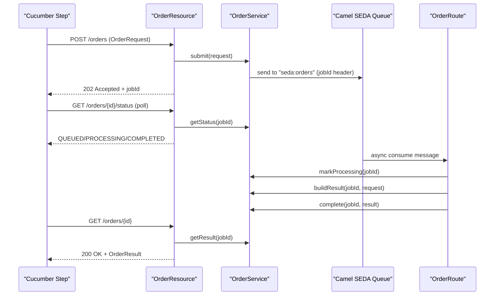

# Quarkus Asynchronous Design Pattern (Apache Camel + BDD)

This project demonstrates a simple asynchronous processing flow in Quarkus using Apache Camel's `seda` endpoint and Cucumber BDD tests.

## Architecture Diagram



## Run Tests

```bash
mvn test
```
